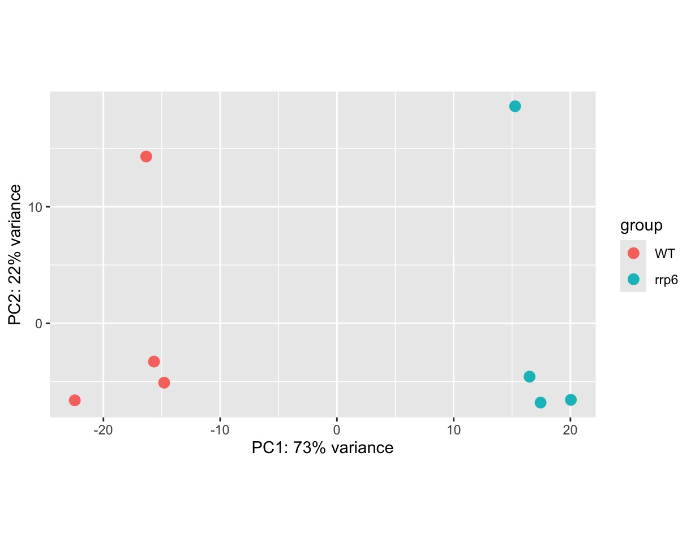
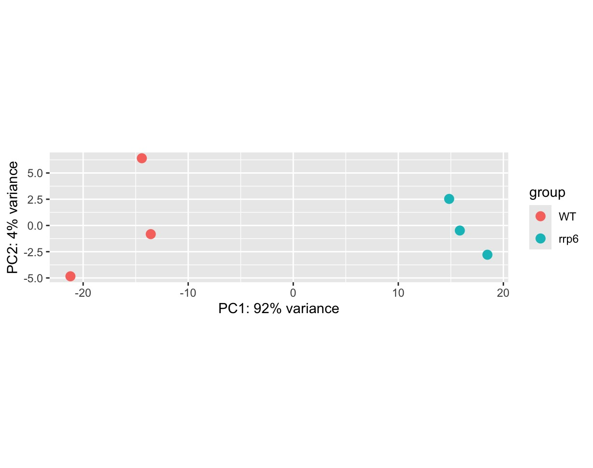
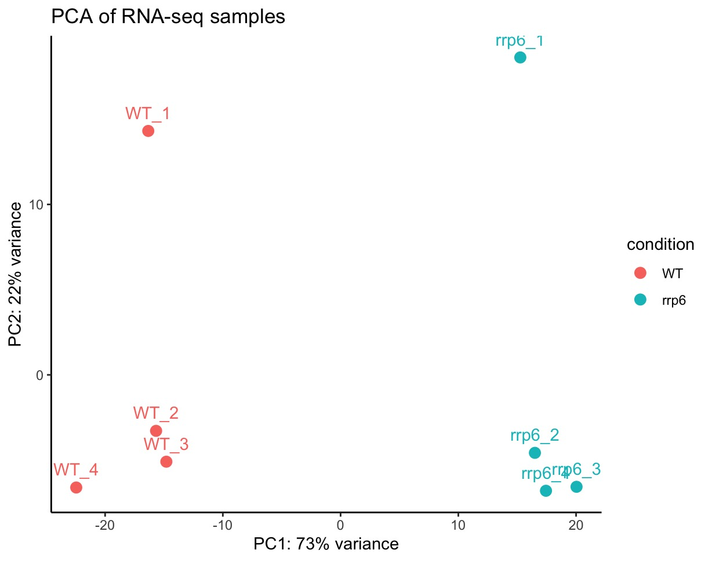
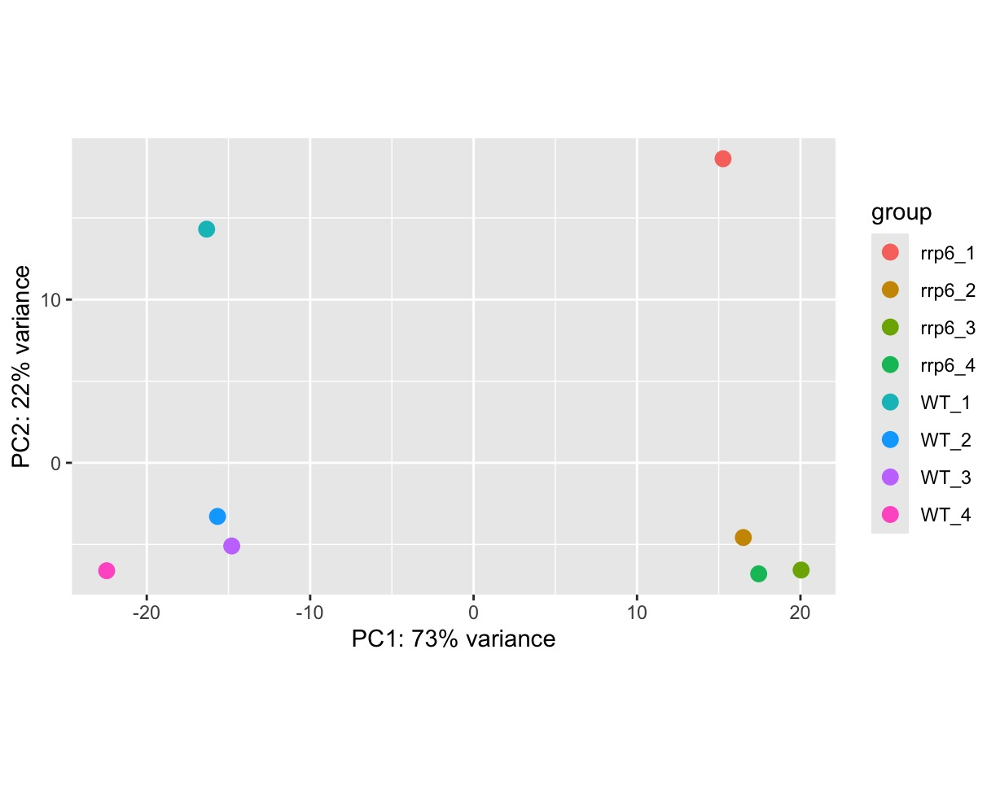
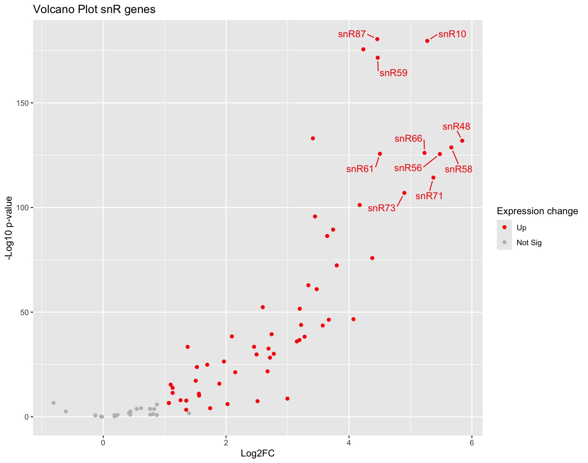

# 📊 Full RNA-seq Analysis in Yeast

## 🧬 Project Overview
Re-analysis of 24 yeast RNA-seq samples to investigate stabilization of snRNAs upon RRP6 deletion. Built using Snakemake and R for a reproducible and modular pipeline.

## 📁 Data Source
- GEO Accession: [GSE135056](https://www.ncbi.nlm.nih.gov/geo/query/acc.cgi?acc=GSE135056)
- Original Study: [PMID: 32187185](https://www.ncbi.nlm.nih.gov/pubmed/32187185)
- Re-analysis co-authored publication: [Microbial Cell Publication 2024](https://doi.org/10.15698/mic2024.05.823)

## 🔧 Pipeline Structure
- Raw data → QC → Trimming → Alignment → Counting (Automated via Snakemake)
- Downstream analysis via DESeq2, PCA, volcano plots, heatmaps (R)

## ⚙️ Tools & Dependencies
- Snakemake ≥7.0  
- HISAT2, SAMtools, FastQC, featureCounts  
- R ≥4.2 with DESeq2, ggrepel, pheatmap  
- Conda env spec: [`rnaseq_env.yaml`](/envs/rnaseq_env.yaml)

## 📦 Directory Structure
<pre>
  .
├── .DS_Store
├── .Rhistory
├── .snakemake
├── alignment
├── benchmarks
├── config
├── counts
├── csvs
├── dir_structure.txt
├── envs
├── figures
├── logs
├── quality-check
├── raw_data
├── reference
├── reports
├── scripts
├── Snakefile
└── trimmed
</pre>

16 directories, 4 files


## 🚀 How to Run
1. Clone repo and create conda env:
   ```bash
   conda env create -f envs/rnaseq_env.yaml

## 🧠 Biological Insight & Sample Curation

This re-analysis obtains the raw reads for the WT and *rrp6*-Δ samples from the original study by Victorino et al., 2020.

The primary objective of this study was to confirm the wet-lab hypothesis that **RRP6p** is responsible for degrading mature snRNAs in Baker's yeast *Saccharomyces cerevisiae*. This is an overly simplified version of the actual problem which is detailed in the publication Chaudhuri et al., 2024. Upon analysing the full dataset of 24 samples, we obtained volcano plots and heatmaps that clearly showed a significant upregulation of most (58/81) snRNAs in yeast, which is exactly what was predicted from our experiments.

During exploratory PCA of variance-stabilized counts, we identified one **biological replicate in both WT and rrp6 knockout conditions** to show **~22% variation** compared to its group centroid. To ensure robust differential expression results, this outlier was excluded prior to running DESeq2 once again.

Both the analyses scripts are included in the original along with the removal of the outliers. The PCA plots from before and after the removal of outliers are provided below.

The outliers were identified in 2 modified PCA plots, with one plot having a standard approach with labels while another with a more colourful approach to identify the replicates.

### 🔬 PCA plot (before removing outlier)


### 🔬 PCA plot (after removing outlier)


### 🔬 PCA plot (identifying by labels)


### 🔬 PCA plot (identifying by colour)


### 🌋 Volcano plot highlighting snRNA stabilization


This approach preserved biological signal while ensuring technical reproducibility. The snRNA specific volcano plot revealed that majority of the snRNAs were upregulated significantly, thereby reinforcing the hypothesis that **RRP6 actively degrades mature snRNAs under normal conditions**.

